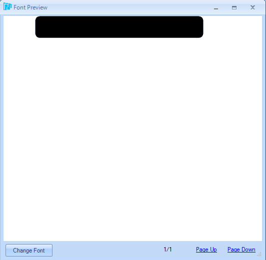
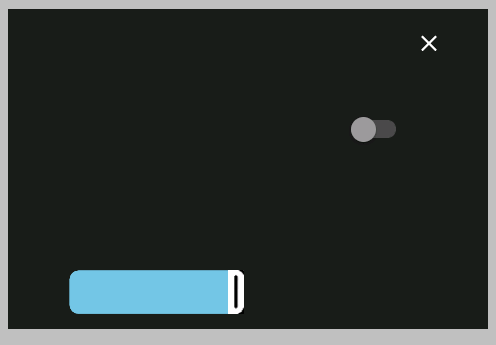
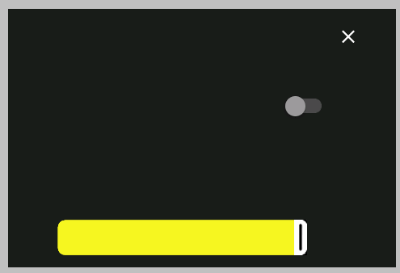

# Nextion - Custom Rounded Sliders

I think I have found a solution to achieve rounded corners, while still having all colors available.

## Step by step instructions

I created a custom font, that will serve as the colored bar. It contains two code points ("a" and "b"), which represent the right and left side of the slider:



Then I removed the pic (Background Image) and pic1 (Foreground Image) of the slider.

To display the bar, I added this code Touch Release Event and the Touch Move Event of the Slider:

````
//draw colored bar
xstr 61,261,340,58,7,col.val,6371,0,0,1,"ab"
//draw black strip to the right of the slider
xstr hBrightness.val*33/10+61,261,400,58,7,6371,6371,0,0,1,"ab"
//(only for the Touch Release Event) force a redraw of the slider, to ensure it is on top
vis hBrightness,1
````

## Result



