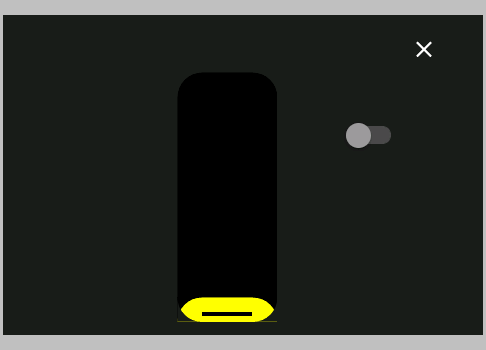
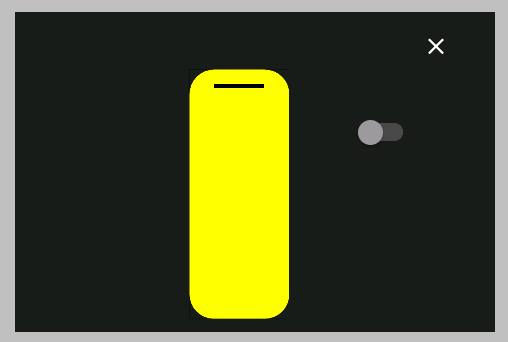

# Nextion - Custom Rounded Sliders

I think I have found a solution to achieve rounded corners, while still having all colors available.

## Horizontal

### Step by step instructions

I created a custom font, that will serve as the colored bar. It contains two code points ("a" and "b"), which represent the right and left side of the slider:


Then I removed the pic (Background Image) and pic1 (Foreground Image) of the slider.

To display the bar, I added this code Touch Release Event and the Touch Move Event of the Slider:

````
//draw colored bar
xstr 61,261,340,58,7,col.val,6371,0,0,1,"ab"
//draw black strip to the right of the slider
xstr hBrightness.val*33/10+61,261,400,58,7,6371,6371,0,0,1,"ab"
//(only for the Touch Release Event) force a redraw of the slider, to ensure it is on top
vis hBrightness,1
````

### Result


## Vertical

To achieve the same look for the vertical layout, a few changes had to be made. It turns out, that it is not possible to align a charater, so only the bottom part of the charater is visible. To solve this, I created a second charater, that is the inverse of the first character. 


````
//draw black background
xstr 174,57,100,250,8,BLACK,6371,0,0,1,"a"
//draw draw colored bar at the position of the current brightness value
xstr 174,hBrightness.val*-25/10+307,100,hBrightness.val*25/10,8,col.val,BLACK,2,4,1,"a"
//paint an inverse of the bar over everything, this rounds the corner at the bottom
xstr 174,57,100,250,8,6371,0,0,0,3,"b"
if(hBrightness.val>7)
{
  //draw cursor
  fill 199,hBrightness.val*-25/10+322,50,4,BLACK
}
````



